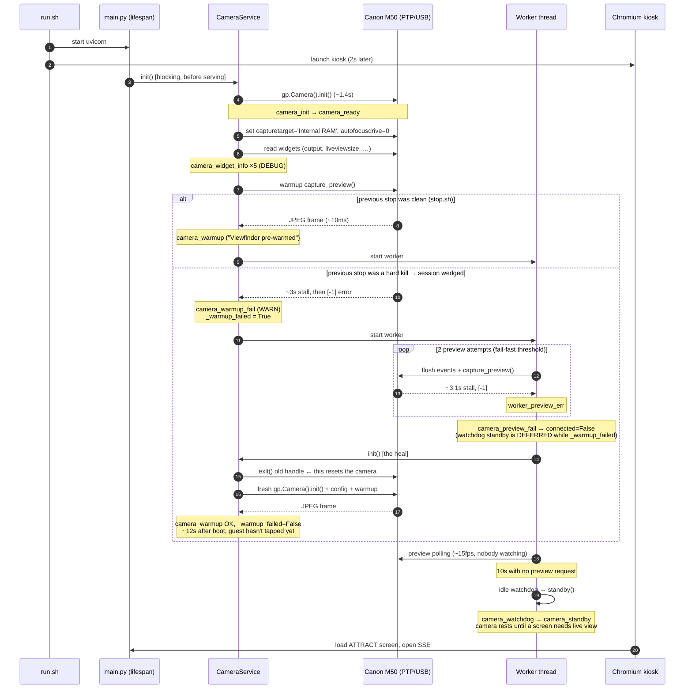
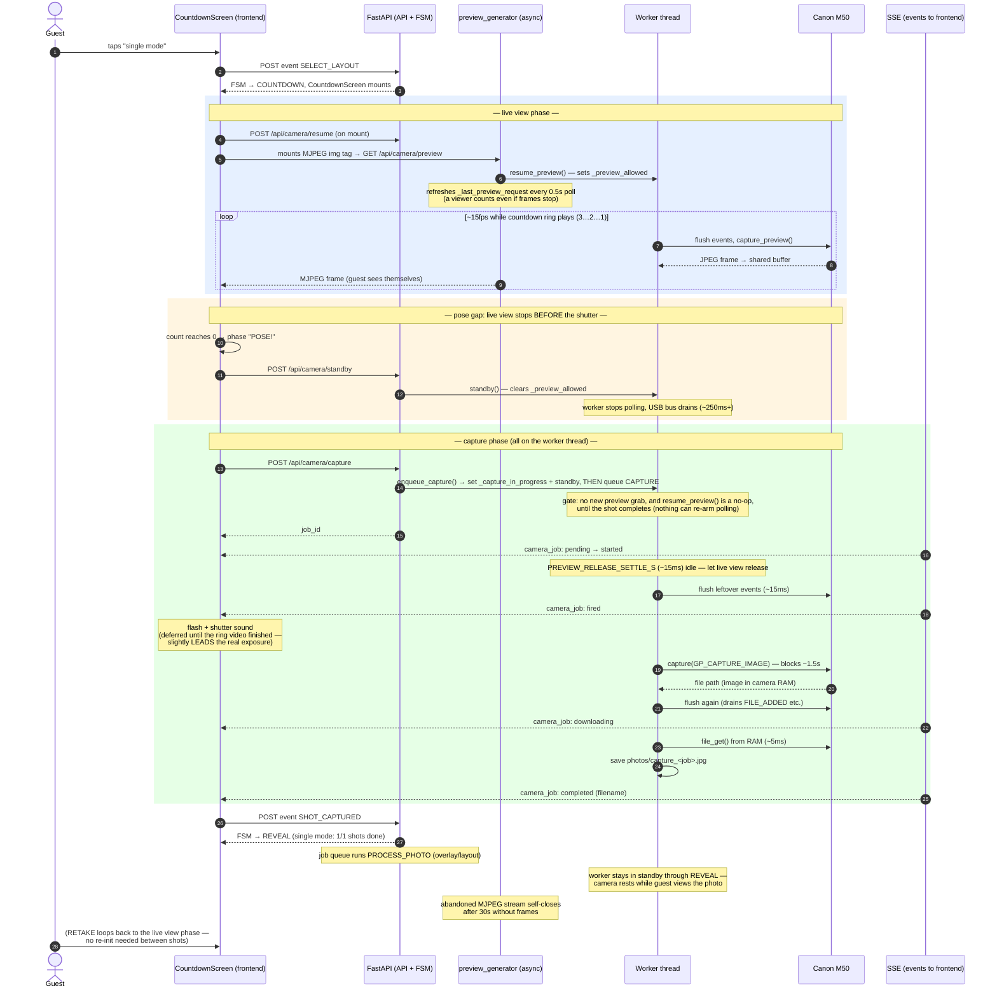

# CAMERA_SEQUENCES — Startup & Countdown-to-Reveal Flows

Two sequence diagrams for onboarding: what the camera stack does when the
booth boots, and what happens from the guest tapping **single mode** until
their photo appears on the REVEAL screen. Diagrams are
[Mermaid](https://mermaid.js.org/) — GitHub and most IDEs render them
inline. Log event names (`like_this`) match what you'll grep in
`logs/backend_<ts>.log`.

Background on *why* the flows look like this (wedged sessions, stall
cycles, flush rules) lives in [CAMERA_NOTES.md](CAMERA_NOTES.md).
Component-level architecture is in [ARCHITECTURE.md](ARCHITECTURE.md).

---

## 1. App Startup

Covers both boot variants: after a **clean stop** (`stop.sh` ran
`camera.exit()`) the first session is healthy; after a **hard kill / power
cut** the first session is wedged and self-heals in ~12s (see
CAMERA_NOTES §2). Either way the camera ends up resting in standby until a
guest reaches a screen that needs live view.

**Key takeaways for a new dev:**

- `init()` runs in the FastAPI lifespan **before** the server accepts
  requests — the kiosk may retry for a couple of seconds on a slow boot.
- A failing warmup preview is **expected** after a power cut. Don't "fix"
  it: the fail-fast + re-init heal is deliberate, and shortcuts (in-place
  session rebuilds) are proven to poison the camera (CAMERA_NOTES §1).
- The worker thread owns **all** camera USB I/O from here on. Nothing else
  talks to the M50 directly.
- Idle rest is the steady state: on the ATTRACT screen the camera is in
  standby, not streaming.

---

## 2. Countdown → Capture → Reveal (single mode)

Starts where the guest taps single mode on CHOOSE_STYLE. The countdown
screen is the **only** screen that mounts the MJPEG live view.

**Key takeaways for a new dev:**

- **The FSM never touches the camera.** The frontend calls camera endpoints
  and reports `SHOT_CAPTURED`; the backend owns retries and job state — the
  frontend only ever sees one terminal `completed`/`failed` per shot.
- **Live view and capture never overlap.** From `enqueue_capture()` the
  capture is authoritative — `_capture_in_progress` blocks new preview grabs
  and makes `resume_preview()` a no-op, so nothing can re-arm polling before
  the shutter (CAMERA_NOTES §6). Combined with a **≤5s countdown** — so the
  shutter lands in the fresh ~6s live-view window (§3) — captures no longer
  ride into the periodic stall.
- **Failure is handled below the UI**: a failed trigger/download is retried
  once inside `_execute_capture_job()` (new shot, ~1.5s later). The guest
  sees the error screen only if both attempts fail.
- **Nothing resumes preview automatically** after a capture. Live view
  returns when a screen that needs it mounts (retake / next session), which
  is what lets the camera rest during REVEAL.
