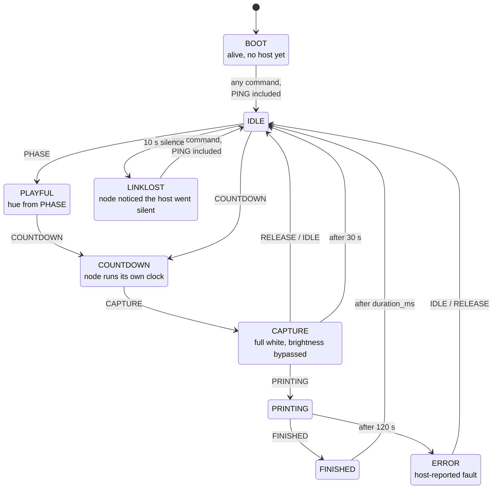

# LED_NODE_ARCHITECTURE — ESP32 Firmware Design

How `led-node/` is structured to deliver the behavior in
[LED_SPEC.md](LED_SPEC.md). That document says *what the ring does*; this one
says *how the firmware is arranged to do it*.

**Status:** implemented and building on ESP-IDF 6. All nine modes, both
transports, the parser and the render pipeline exist and run. **Nothing has been
verified with a strip attached** — PWM banding, colour rendition, current draw
and thermal shift are all unmeasured. See
[LED_NODE_TESTING.md](LED_NODE_TESTING.md) for what is and is not provable on
the bench.

> **Where the rationale lives.** Design *reasoning* belongs in the header that
> owns the constraint — `modes.h` on state ownership, `anim.h` on animation
> purity, `canvas.h` on gamma ordering, `transport.h` on swap-safety. That is
> where someone about to break an invariant will actually read it. This document
> owns the cross-cutting picture and links to those headers rather than
> restating them, because a restated argument is one nobody updates.

---

## Platform

- **ESP-IDF, C.** Not Arduino. The existing scaffold is an IDF project
  (`CMakeLists.txt` + `idf_component.yml` + `Kconfig.projbuild`).
- **LED driver: `espressif/led_strip`** from the component registry, RMT
  backend, `LED_PIXEL_FORMAT_GRBW`. It exposes `led_strip_set_pixel_rgbw()`,
  which is what Capture's W-channel requirement needs.
- **RMT, specifically.** RMT output is hardware-timed and DMA-fed, so it is
  unbothered by interrupt latency spikes from the WiFi stack. A bit-banged
  driver would visibly glitch under the dev build. This is what makes it safe to
  develop over WiFi and ship over serial without the rendering behavior changing.

---

## Concurrency: why there is a command queue

`esp_http_server` is not a poll-from-your-loop server. `httpd_start()` spawns its
own task, and URI handlers execute on it. Concurrency is not optional here — the
HTTP handler and the render loop are on different tasks whether or not the design
acknowledges it.

Rather than put a mutex around mode state, **transports never touch mode state at
all.** They produce commands onto a queue and wait for a reply:

```c
typedef struct {
    command_t     cmd;
    QueueHandle_t reply_q;   // where the render task posts the result
} cmd_req_t;
```

The render task is the sole owner of mode state, so there is no lock anywhere in
the system.

This is also what makes the dev→booth transport swap safe: the queue *is* the
seam. Nothing above it can tell which transport is running.

## Task model

| Task | Core | Prio | Role |
|---|---|---|---|
| `render_task` | 1 | 6 | Owns mode state + framebuffer. Drains queue, renders, refreshes strip. |
| `httpd` (**ships**) | any | 5 | Parses `/cmd`, enqueues, blocks on reply, responds. |
| `uart_task` (future UART version) | any | 5 | Blocks on `uart_read_bytes`, parses, enqueues, writes reply line. |

**Frame budget.** `FRAME_MS = 8`, so **125 Hz**. `led_strip_refresh()` for 60
RGBW pixels is ~2.4 ms (calculated from the 1.25 µs bit period — *not* measured),
leaving ~5.6 ms for queue drain, deadline checks and up to two animation
evaluations. Cadence comes from `vTaskDelayUntil`, which both holds a fixed rate
and yields cleanly.

**Pinning.** ESP-IDF defaults the WiFi task to core 0, so pinning the render task
to core 1 isolates it during the dev build. On a single-core part (C3, C6) that
option doesn't exist and the priority ordering is what protects the frame rate
instead.

**Latency.** The render task drains the queue at frame start, so a command waits
at most one frame (~8 ms) before it is applied. Transports use a 200 ms reply
timeout, which is an error detector rather than an expected wait.

## Mode state machine

Nine modes, in [`modes.h`](../led-node/components/render/include/modes.h).
Every edge is either a command from the Pi or a deadline the node evaluates
itself in `check_deadlines()`.



The graph is drawn along the happy path for readability. It is **not** a
restriction: `apply()` is a flat switch with no mode gating, so every command
edge above is available from every state. The watchdog edge into `LINKLOST`
likewise fires from any mode except `BOOT` and `LINKLOST` itself.

### Transitions

| From | Trigger | To | Notes |
|---|---|---|---|
| any | `IDLE`, `RELEASE` | Idle | `RELEASE` is an exact alias — same `case` |
| any | `PHASE <hue>` | Playful | hue stored in params |
| any | `COUNTDOWN <ms>` | Countdown | node then times itself |
| any | `CAPTURE` | Capture | |
| any | `PRINTING` | Printing | |
| any | `FINISHED <ms>` | Finished | |
| any | `ERROR <code>` | Error | |
| Boot, Link Lost | `PING` | Idle | the heartbeat is how the link comes back |
| any other | `PING` | *no change* | feeds the watchdog only |
| Printing | 120 s elapsed | Error (`code 0`) | a jammed printer must not roll ink forever |
| Capture | 30 s elapsed | Idle | full white is the highest-current, highest-heat state; never held indefinitely |
| Finished | `duration_ms` elapsed | Idle | resolves itself so the ring is not celebrating at nobody |
| any except Boot, Link Lost | 10 s since **any** inbound line | Link Lost | |

**Boot** is exempt from the watchdog — it has never heard from the host, so
"silence" is its normal condition, not a fault.

**Watchdog entry and recovery are symmetric, and the heartbeat drives both.**
Silence past 10 s enters Link Lost; the next `PING` leaves it. Boot behaves the
same way, so a node powered on while the Pi is already up and idle-pinging
reaches Idle without waiting for a mode command. Recovery is handled in the
`CMD_PING` case specifically — mode commands recover by entering their own
target, and doing it for every inbound line would leave `prev == IDLE` and
cross-fade from a frame that was never on screen.

Rejected lines (`ERR RANGE`, `ERR UNKNOWN`) still leave the mode alone. They
feed the watchdog like any inbound line, but a line we could not parse is not
grounds for a mode change.

**Entering Link Lost from Capture is the safety case the watchdog exists for.**
A host that dies mid-shot must not strand the strip at full white.

**Cross-fade** (200 ms, `MODE_CROSSFADE_MS`) applies to every transition except
into Capture, and is skipped when the new mode equals the old one. Capture is
excluded because it owns its own 100 ms ramp and fading it against a decorative
mode would put motion in the key light.

**Re-entering a mode restarts it.** `enter()` unconditionally resets
`entry_ms`, so a second `COUNTDOWN 3000` restarts the clock rather than being
ignored.

---

## Layer stack

```
transport (http | uart)     ── parses, enqueues, awaits reply
        │  cmd_req_t queue        transport_http.c | transport_uart.c
        ▼
mode manager                ── current mode + params + entry time,
        │                      transitions, timeouts, link watchdog,
        │                      AND the cross-fade            modes.c
        ▼
animations                  ── anim_fn(elapsed_ms, params, *canvas), one per mode
        │                                                    anim_*.c
        ▼
output                      ── brightness → geometry → gamma LUT → strip
                                                             output.c
```

There is no separate compositor. Cross-fading is nine lines inside
`render_frame()` ([`modes.c:212`](../led-node/components/render/modes.c)) — it
renders the outgoing mode into a second canvas and calls `canvas_blend`. An
earlier draft of this document gave it its own layer; the code never did, and a
layer that is one `if` statement does not earn the name.

---

## The three decisions that shape the code

### 1. Animations are pure functions of elapsed time

`render(elapsed_ms, params, canvas)` — no internal state, no accumulators.

This is not stylistic. The 200 ms cross-fade in the spec requires rendering the
outgoing *and* incoming mode within the same frame, which is only possible if a
mode can be evaluated at an arbitrary `t` without having been "running." It also
eliminates drift and makes every animation testable by evaluating it at a
timestamp.

The one exception is Finished's sparkles, which need randomness. Seed a PRNG
deterministically from mode-entry time and frame index so it remains a pure
function of `t`.

### 2. Blend in linear space; gamma is the last step

The canvas holds **linear** RGBW (uint16 or float). Cross-fades, brightness, and
compositing all happen in linear space. The gamma LUT (γ ≈ 2.2) is applied once,
immediately before handing bytes to `led_strip`.

Cross-fading two gamma-encoded buffers produces a visible dip through the
midpoint — the fade appears to duck dark halfway. Getting this order wrong is the
usual reason a project has a gamma table and *still* looks cheap.

### 3. Sub-pixel rendering lives in the primitives

Three additive drawing primitives ([`canvas.h`](../led-node/components/render/include/canvas.h)):

```c
void canvas_add_point(canvas_t *c, float deg, rgbw_t color, float falloff_deg);
void canvas_add_arc  (canvas_t *c, float deg_start, float deg_span, rgbw_t color);
void canvas_add_field(canvas_t *c, canvas_field_fn fn, void *ctx);
```

Note `deg_span`, not an end angle — arcs are start-plus-extent, which is what
makes a growing arc a single animated parameter.

All three anti-alias across pixel boundaries. Every animation is built from
them, so no animation *can* forget to sub-pixel. `RING_OFFSET` / `RING_DIRECTION`
are applied in exactly one place, and it is not here — it is in `output.c`, the
only file that knows a physical pixel exists.

Compositing helpers (`canvas_blend`, `canvas_scale`, `canvas_clear`,
`canvas_fill`) and colour construction (`rgbw_make`, `rgbw_hue`, `rgbw_white`,
`rgbw_lerp`, …) round out the surface.

**Animations work in degrees and never see a pixel index.** That is what lets the
physical seam land wherever mounting is convenient.

---

## Transport abstraction

```c
/* transport.h — implemented by exactly one of transport_http.c / transport_uart.c */
esp_err_t transport_start(QueueHandle_t cmd_q);
void      transport_stop(void);
```

Selection is at **compile time** via Kconfig, so the abstraction is a shared
signature rather than a struct of function pointers — there is no vtable and no
runtime dispatch, because there is never more than one implementation linked.
Both do the same three things, in `transport_common.c` so neither can drift:
parse a line with the shared parser, enqueue it, wait for the reply and return
it to the caller.

> The Pi-side client cannot copy this shape exactly. It selects its transport
> from config at runtime, so it needs a real interface. What carries over is the
> contract — one line in, one reply line out, one command in flight — not the
> mechanism. See [LED_UART_SWITCH.md](LED_UART_SWITCH.md).

### Which transport ships

**HTTP over WiFi is the production transport.** One transport to build, harden
and test rather than two; the ESP32's USB stays free for flashing, and the Pi is
spared a udev rule, baud config and device-node churn.

This reverses [LED_SPEC.md](LED_SPEC.md)'s original call. That reasoning has not
been refuted — a wedding venue really is a hostile 2.4 GHz environment, and
retries really do land in the countdown-to-shutter window. The risk is being
accepted deliberately, on the bet that a dedicated AP on a hand-picked channel
with the node as its only client keeps the tail small enough.

UART remains a **future version**, not an event-day fallback: `transport_uart.c`
is written but has never been compiled or run, and switching means reflashing
plus first-ever integration. If HTTP proves unreliable — measured, per the
trigger conditions in that document — it gets built then.

> Everything needed to reverse this later, and the handful of cheap choices the
> HTTP client must make *now* to keep the reversal cheap, is in
> **[LED_UART_SWITCH.md](LED_UART_SWITCH.md)**. Read it before writing the Pi
> client.

**One parser, one vocabulary.** There is no REST *command* surface — no
`/capture`, `/countdown`, `/idle`. A single `/cmd` endpoint carries the identical
ASCII line the UART carries:

```
POST /cmd      body: COUNTDOWN 3000
GET  /cmd?c=CAPTURE          ← typeable in a browser, handy during setup
```

Two vocabularies would drift, and the drift would surface as a behavior
difference on the night the transport changes. One parser makes the swap
provably behavior-identical.

The HTTP transport also serves three **read-only, dev-only** endpoints
([`transport_http.c:258`](../led-node/components/transport/transport_http.c)):

| Endpoint | Purpose |
|---|---|
| `GET /` | Preview page: ring rendering plus a button per mode |
| `GET /frame` | The exact bytes the strip received — `output_snapshot()`, post-brightness, post-geometry, post-gamma, in physical pixel order |
| `GET /state` | Render-task introspection — `modes_get_state()` |

These do not weaken "one vocabulary": none of them accepts a command. `/frame`
is what makes the whole system observable with no strip attached, which is the
entire basis of [LED_NODE_TESTING.md](LED_NODE_TESTING.md).

### The dev-only endpoints in a production build

`/`, `/frame` and `/state` were written as development instrumentation on the
assumption that the booth build would have no network. Under an HTTP production
build they ship. That is mostly a benefit — `/state` and `/frame` are exactly
what you want for on-site diagnosis, and there is no console over WiFi — but it
means the preview page is reachable by anything on the AP. Keep the node on a
dedicated network with the Pi, not on a venue SSID.

---

## Wire protocol

ASCII, newline-terminated, human-typeable on purpose — the whole booth can be
driven from a serial monitor at the venue with no tooling.

| Line | Valid argument | Reply | Enters mode |
|---|---|---|---|
| `IDLE` | — | `OK IDLE` | Idle |
| `PHASE <hue>` | 0–359 | `OK PHASE` | Playful |
| `COUNTDOWN <ms>` | 1–60000 | `OK COUNTDOWN` | Countdown |
| `CAPTURE` | — | `OK CAPTURE` | Capture *(Pi waits for this, then fires)* |
| `RELEASE` | — | `OK RELEASE` | Idle *(exact alias of `IDLE`)* |
| `PRINTING` | — | `OK PRINTING` | Printing |
| `FINISHED <ms>` | 1–60000 | `OK FINISHED` | Finished |
| `ERROR <code>` | any int ≥ 0; **effective 1–9** | `OK ERROR` | Error |
| `PING` | — | `PONG` | **none — see below** |

Three reply forms, not two:

- `OK <verb>` — applied.
- `ERR RANGE` — verb understood, argument out of the range above. Mode is
  **unchanged**.
- `ERR UNKNOWN` — unparseable: unknown verb, missing or non-numeric argument, a
  negative number (the parser accepts digits only), or extra tokens after a
  no-argument verb. Mode is unchanged, and this is never a fault state, so the
  two artifacts can version independently.

**Any command is legal in any mode.** There is no gating in `apply()` — a
`COUNTDOWN` during `PRINTING` is accepted and applied. This follows from the node
being a pure sink ([LED_SPEC.md](LED_SPEC.md)): the Pi owns sequencing, and a
node second-guessing it could only ever disagree with the booth's actual state.

`PING` is not debug sugar. The link watchdog measures time since *any* received
line; without a heartbeat, a booth sitting in Idle for an hour would trip into
Link Lost while nothing is wrong. The Pi sends `PING` every ~2 s.

---

## Component layout

```
led-node/
  CMakeLists.txt              project(led_node)
  sdkconfig.defaults
  main/
    CMakeLists.txt
    Kconfig.projbuild         ring size, data GPIO, RING_OFFSET, direction, wifi
    main.c                    init + task creation only
  components/
    protocol/                 command_t, the one parser  ← host-testable
    transport/                transport.h, transport_http.c, transport_uart.c
                              transport_common.c  ← parse+enqueue+await reply,
                                            shared by both so the swap cannot
                                            change command semantics
                              wifi_sta.c  ← the HTTP transport owns its own
                                            connectivity, so a UART build pulls
                                            in no networking at all
    render/
      canvas.[ch]             linear framebuffer, canvas_add_point/canvas_add_arc
      output.[ch]             brightness, gamma LUT, geometry, led_strip push
      modes.[ch]              mode manager, transitions, timeouts, watchdog
      anim_idle.c
      anim_playful.c
      anim_countdown.c
      anim_capture.c
      anim_printing.c
      anim_finished.c
      anim_error.c
      anim_boot.c
      anim_linklost.c
```

Parsing lives in its own component rather than in either transport — that is what
structurally prevents a second vocabulary from appearing.

## Build configuration

Transport is a Kconfig `choice`, with `main/CMakeLists.txt` selecting sources so
the booth binary does not contain the WiFi stack at all:

```
choice LED_NODE_TRANSPORT
    prompt "Command transport"
    default LED_NODE_TRANSPORT_HTTP
    config LED_NODE_TRANSPORT_HTTP     bool "HTTP (development)"
    config LED_NODE_TRANSPORT_UART     bool "UART (booth)"
endchoice
```

`MINIMAL_BUILD ON` is already set in the root CMakeLists and should stay.

**`espressif/led_strip` must be pinned to 3.x on ESP-IDF 6.** Version 2.5.5
declares only `idf: '>=4.4'`, so the component manager installs it without
complaint — but its SPI backend uses `MALLOC_CAP_*` and `heap_caps_calloc`
without including `esp_heap_caps.h`, relying on a transitive include that IDF 6
removed. That file is compiled on any target with GPSPI whichever backend we
actually use, so selecting RMT does not avoid it.

## Testing

The scaffold already carries `esp_stubs` and linux-target support in
`idf_component.yml`. That is worth keeping: the parser and the animation math are
pure functions by design, so both can be host-compiled and unit tested with no
hardware. Rendering a mode at a given timestamp and asserting on the resulting
canvas is a normal unit test.

---

## Risks & known defects

Scaffold remediation is **complete** — `project(led_node)`, the LED Node Kconfig
menu, `/cmd`, a real `app_main`, and a populated `sdkconfig.defaults` are all in
place, and the stock example's handlers and pytest are gone. The
`protocol_examples_common` / `example_connect()` dependency that tied the build
to Espressif's examples tree is likewise gone, replaced by
`transport/wifi_sta.c` with `LED_NODE_WIFI_*` options; `main` requires no
networking components at all. Git history holds the details.

What remains:

| Risk / defect | Trigger | Mitigation |
|---|---|---|
| **Nothing verified with a strip attached** | First power-on with real LEDs | PWM banding at 1/200 s, colour rendition, current draw and thermal shift are all unmeasured. Budget bench time before the event. |
| Link recovery is fixed but unexercised | Any disconnect | The heartbeat now exits Boot and Link Lost, but the change has not been run on hardware on either transport. Bench step added to [LED_NODE_TESTING.md](LED_NODE_TESTING.md); run it before trusting it. |
| Capture ack timeout is tuned on WiFi, not serial | Transport swap | Retune on serial — the latency distributions are not comparable, and this timeout is what stands between a hiccup and a dark photo. |
| Serial bring-up is more than a firmware change | Event day | udev rule pinning the ESP32's USB serial to a stable `/dev/led-node`, baud, buffer sizes, Pi-side client. Do this **well before** the event. |
| `PING`/`PONG` dropped from one build | Transport swap | Keep it in both, or the watchdog's first real test is in production. |
| Console shares UART0 with the protocol | Booth build with `LED_NODE_UART_PORT=0` | Set `CONFIG_ESP_CONSOLE_NONE` (commented stub already in `sdkconfig.defaults`) or `ESP_LOG` output corrupts the stream the Pi parses. |

WiFi retries forever rather than failing — a node that gave up because the
hotspot was not up yet would need a power cycle to notice it appeared. Modem
sleep is disabled (`WIFI_PS_NONE`), because its tens-to-hundreds of
milliseconds of added inbound latency would make development timings
unrepresentative of the wired transport this becomes.

## Deliberately excluded

- **No mutexes.** One owner for mode state; everything else goes through the
  queue.
- **No dynamic allocation** in the render path. Fixed canvases (~1 KB for two
  60×4 linear buffers), fixed command struct.
- **No JSON, no binary protocol.** ASCII lines until they demonstrably hurt.
- **No OTA.** The original reason — the booth build has no network — no longer
  holds now that HTTP ships, so this is a live choice rather than a consequence.
  It stays excluded: flashing is over USB, and an update path that can brick the
  node over a congested link is a worse risk than the one it solves.
- **No REST command surface.** One `/cmd` endpoint, one parser. `/`, `/frame`
  and `/state` are read-only dev instrumentation and exist only in the HTTP
  build.
